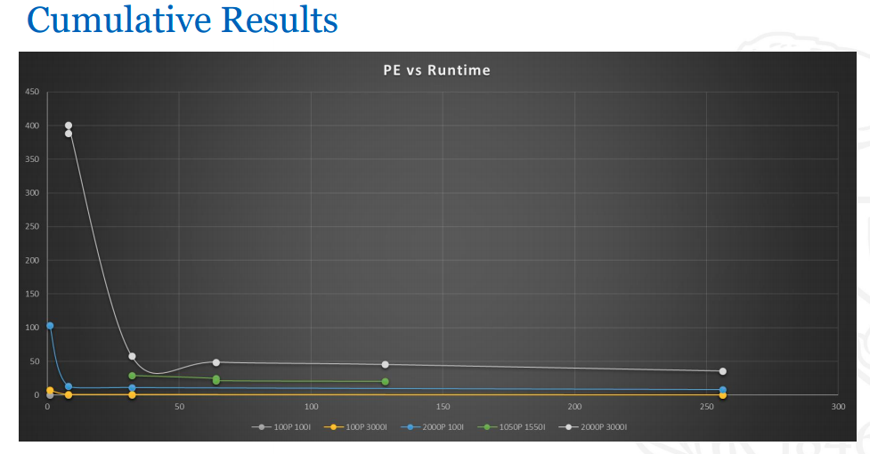

# cse633-mpi-nbody-simulation

## Introduction
Simple gravitational N-body simulation using MPI for CSE633 - Parallel Algorithms.

## Approach

The algorithm is a simple one for a serial implementation:

- Calculate force on each particle from every other particle
- Compute the net force on each particle based on above
- Update the positions and velocities of each particle based on net force calculated
- Repeat

The parallel algorithm in MPI simply parallelizes the first step where each particle's computation happens on a single core in parallel. More details are available in ```pseudo_code.txt```.

## File Description

- ```main.c```: The actual MPI implementation of a simple n-body calculation; the no of particles and no of iterations are hard-coded but can be parameterized
- ```generate.py```: Generates a random dataset for initial positions and velocities of the particles; ```PARTICLE_COUNT``` is defined in the file
- ```visualize.py```: Creates a Tkinter based animation that visualizes each iteration of the particles being acted upon by mutual gravitational forces
- ```input.txt```: Output redirected to file from ```generate.py``` containing the initial positions for each particle
- ```viz_data_25_25.txt```: Sample viz data generated for 25 particles for 25 iterations that can be used by ```visualize.py``` to visualize the simulation
- ```./job_*/job_*.sh```: Directory contains a job script for CCR; pattern defined as 1-node, 1-core-per-node, 100-particles, 100-iterations for each job
- ```pseudo_code.txt```: Simple description of the algorithm used
- ```results.png```: Simple graph for the final cumulative results
- ```README.md```: Contains the MD content for this README page

## Steps to run

- Run ```python3 generate.py | tee input.txt``` to generate initial data in ```input.txt```
- Set required values of particle count, iterations, etc. and compile ```main.c``` with below command:
```mpicc main.c -lm -o nbody_<particle_count>_<iteration_count>```
- Run with ```mpirun -n <core_count> nbody```
- Measure the time based on the output print for the run
- [Optional] Edit the file name in ```visualize.py```, if changed, and run with ```python3 visualize.py``` to view visualization

## Final Results

The results can be interpreted as each line representing the runtime of different combinations of complexity (```particles``` * ```iterations```) for different PEs (no of processing elements aka ```nodes``` * ```cores per nodes```)




**NOTE:** Check corresponding ```job.sh``` script to see how ```mpirun``` is called for each job & refer to UB-CCR documentation on how to run these job files.